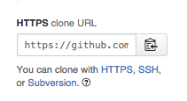

# Table XI Simple Solution

Hi. You're here for the simpler solution to the Table XI challenge. To get it going, do the following.

1. Copy this repo url by clicking the clipboard to the right that looks like this: 
2. Open you command line and type ```git clone``` and then paste the repo url. Press enter.
3. In the command line, type ```cd table_xi_tech_spike``` and hit enter.
4. From here, type ```ruby table_xi_menu_solver```. Press enter.
5. You'll then be prompted to manually enter the file path of the menu you want to test. Don't know where one might be? No worries. There is one supplied already. Simply type ```menu.txt```.

Voila! If you have supplied a text file with valid solutions, you'll see them displayed in your command line.
